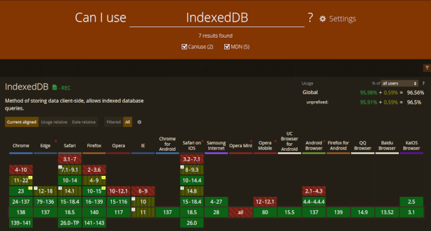

# Fast Notes

A simple PWA application to quickly store your notes...

## About
This project uses **IndexedDB** to store notes locally so, the only limitation is browser compatibility. 

[](https://caniuse.com/?search=IndexedDB)

## Demo
[https://phsgoes.github.io/fast-notes](https://phsgoes.github.io/fast-notes)

## Installation

No need for package manager such as **npm**, **yarn** or **pnpm**. This project is very simple and only uses **HTML**, **CSS** and **Vanilla JS**. All you have to do is:

```bash
git clone git@github.com:phsgoes/fast-notes.git
```

Modify the files as needed, host them to access it via https in some domain and install the PWA app as your browser suggests.
